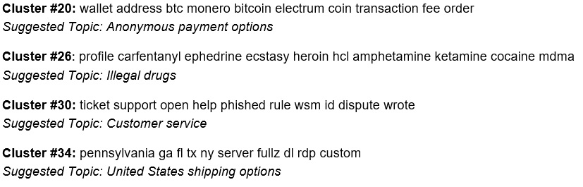

<h1> What's Trending in the Darknet?</h1>
<h3> Wall Street Market Topic Modeling and Sentiment Analysis </h3>

<h2> What the Authorities Don't Tell You </h2>

    Darknet markets are abstract to the public. Some of us may have watched Mr. Robot. Others may have read about the arrest/jail sentencing of Ross Ulbricht AKA "Dread Pirate Roberts", the creator/operator of Silk Road, which is estimated to have averaged $15 million in annual sales.

    If one were to visit a darknet market, he/she will find a thriving economic ecosystem that resembles Ebay. Simultaneously, these obscure economics are solving complex technical challenges like ensuring anonymity and creating trust among thieves.

    Up until 2019, one of the most prosperous darknet markets was the Wall Street Market (WSM). The illegal virtual bazaar included approximately 5,400 vendors, tens of thousands of items/services for sale, and more than 1.1 million user accounts. At its apex, WSM was the second largest darknet market in the world. In May 2019, in a covert collaboration among investigators from the United States, Germany, and Netherlands, ten individuals were arrested; the offenders were located in the U.S. and Europe. These persons were responsible for creating/operating the WSM. Upon arrest, the authorities seized more than 550k euros.

<h2> Project Motivation and Overview </h2>

    To improve the efficacy of cybercrime operations, authorities should examine and learn the views/habits of the marketplace participants. How do they communicate? How do the vendors transact and transport their products? What are the common critiques and trending topics?

    Like "standard" e-commerce sites, darknet market users communicate via well-organized forums. A collection of these forum posts can serve as a corpus to train natural language processing (NLP) models. Applying topic modeling could help answer the previously mentioned questions. With such insight intelligence agencies would be better equipped to imitate a darkweb market participant.

    After authorities shut down WSM, the National Science Foundation (NSF) the Data Infrastructure Building project which was led by the University of Arizona’s Artificial Intelligence Lab. The corpus is comprised of more than 42,000 posts written by over 5,500 unique members. The posts were published between October 2016 and November 2018.

<h2> Exploring Parts Unkown </h2>

    The line chart below shows the daily number of posts during the life of the dataset. The visualization displays a significant uptick in October 2017. Given lack of transparency of the darknet, I can only speculate what triggered the increase in participation. 

    In July 2017, AlphaBay, which was one of the largest darknet markets at the time, was shut down by U.S., Canadian and Thailand law enforcement. It is possible that AlphaBay users/vendors migrated to WSM. The lag can partially be explained by the application process required for vendors. It is common practice to require vendors to prove their reputation and/or provide cash deposits via cryptocurrencies.

<h3> Wall Street Market Forum Daily Post Frequency </h3>

    As previously mentioned, WSM was a vibrant marketplace comprised of prosperous entrepreneurs. Consequently, the most frequently used words are nearly identical to the words - e.g. vendor, market, bank, and account - that one would expect to be most prevalent in a legal marketplace.

<h3> Wall Street Market Forum Word Frequency</h3>

<h2> Data Processing </h2>

    The forum posts were in html which required parsing and removing of HTML vestige, e.g. "\n". Additionally, most of the writing was informal and serial numbers and websites were referenced throughout the documents. The serial numbers and websites were erased.

    I removed the punctuations and expanded contracted works, e.g. "who's" became "who is". In addition to the default “stop words”, various "noninformative" words were omitted, e.g. "thing" and "could". 

    The documents were then lemmatized, which differs from stemming. Both lemmatization and stemming generate the root form of the documents’ words. The difference is that a lemma is an actual language word whereas a stem may not be a coherent word. After lemmatization, the documents were tokenized. 

    I then transformed the lemmatized tokens using either the Bag-of-Words(BoW) or Term Frequency-Inverse Document Frequency(Tf-Idf) vectorizer. The conversion resulted in numeric vectors that were used as inputs into the NLP models.

<h2> Topic Modeling </h2>

    Two approaches were selected for topic modeling: Latent Dirichlet Allocation(LDA), which applies statistics and K-Means Clustering (K-Means), which uses linear algebra. 

<h3> Latent Dirichlet Allocation </h3>

    As previously mentioned, LDA is a statistical approach to topic modeling. Latent means hidden; therefore, LDA constructs a "hidden" layer, that are imaginary topics. The documents are then defined as a distribution of the imaginary topics. The next phase in the model is to define each imaginary topic by a distribution of words included in the corpus.

    I selected 20 components, an arbitrary value that was primarily elected for ease of visualization. In future revisions, I will identify the optimal value. I also applied two LDA methods. The methods differed in how I transformed/vectorized the documents into numerical values. I used BoW and Tf-Idf vectorization. The charts below demonstrate that BoW was more sucessful in differing the topics within the

<h4> LDA Peformance Assessment</h4>

    To assess the two methods, I used perplexity. Perplexity has limitations - optimizing for perplexity may not yield human interpretable topics. Coherence score is most likely better suited for this task. In this project's second iteration, I will use Gensim instead of Sklearn to implement the LDA model. 
<h3> 

<h3> K-Means Clustering </h3>

    I also applied k-means to obtain a different perspective. I must note that k-means does have limitations. For example, the method defines each cluster by its center; to do so, the model assumes that clusters are convex, distinct, and approximately equal in size. 

    I would have liked to reduced the dataset's dimensionality by applying Linear Discriminant Analysis or Incremental Principal Component Analysis prior to training the KMeans model. Unfortunately, the memory-intensive sparse matrix generated by the Tf-Idf vectorizer caused memory errors when transforming the dataset.

    K-means' most important hyperparamter is the number of clusters. This value is somehwat arbitrary. To identify the optimal value, I calculated the sum and average of the squared errors (intra-cluster variances) - distance among the clusters' centroids and the corresponding datapoints - to see the number of clusters that minimizes the error while being cognizant of overfitting.

    Based on the distortion and inertia plots, which are commonly referred to as "Elbow Graph", I selected 65 clusters. The excerpt below are four selected clusters and their respective ten most common terms. I created the "Suggested Topics" based on the clusters' terms.

<h4> Selected Clusters - Top Ten Terms</h4>

    To assess the kmeans model performance, I used silhouette score. The kmeans' silhouette score on its own does not provide insight; I needed a benchmerk. Consequently, I applied another clustering method referred to as DBSCAN. DBSCAN is an interesting comparison because, unlike kmeans, the algorithm does <b>not</b> assume that the clusters are of convex shapes <b>nor</b> require a priori, i.e. a pre-defined number of clusters.

<h4> KMeans Peformance Assessment</h4>

    DBSCAN has two principal hyperparameters: epsilon and min_samples. min_samples is a threshold to determine which samples can qualify as <b>core samples</b>. I will omit a deep explanation of these hyperparameters as DBSCAN's sole purpose in this project is to establish a baseline silhouette score. I assumed 0.5 and 5 for epsilon and minimum samples, respectively.  

    The kmeans model resulted in a silhouette score of <b>0.06</b> in contrast to a score of <b>-0.14</b> for the DBSCAN. In conclusion, neither of these model performed well. KMeans silhoulette score close to zero represents that, on average, the clusters are not clearly divided. This reconciles with the outcomes from the LDA models.

<h2> Conclusion </h2>

    Unfortunately, neither LDA nor KMeans clustering provided were helpful in organizing the WSM forum posts into clear and distinct groups that allow us to better comprehend the operation and/or primary topics of the darkweb market participants. In the next iteration, I will examine how the removal of generic and ecommerce terms, e.g. vendor, people and sell - affects the outcome. I suspect that omitting these words should allow for the models to more cogently categorize the documents.

    I also applied Non-Negative Matrix Factorization (NMF); unfortunately, the approach generated coherent results than LDA and KMeans.

    It seems that from the three primary topic modeling methods - LDA, KMeans, and NMF - that LDA is best suited for this project. Therefore, in this project's next iteration, I will leverage the Gensim package to optimizing the LDA model.

<h2>Source</h2>

    The Wall Street Market forum dataset was sourced from AZSecure Data, a consortium comprised of faculty from University of Arizona, Drexel University, University of Virginia, University of Texas at Dallas, and University of Utah.

<h2>Packages</h2>
<ul>
    <li>Numpy</li>
    <li>Pandas</li>
    <li>Scikit-learn</li>
    <li>Gensim</li>
    <li>NLTK</li>
    <li>Wordcloud</li>
    <li>Plotly</li>
    <li>Seaborn</li>
    <li>Matplotlib</li>
    <li>Scipy</li>
    <li>Beautiful Soup</li>
    <li>MySQL</li>
</ul>