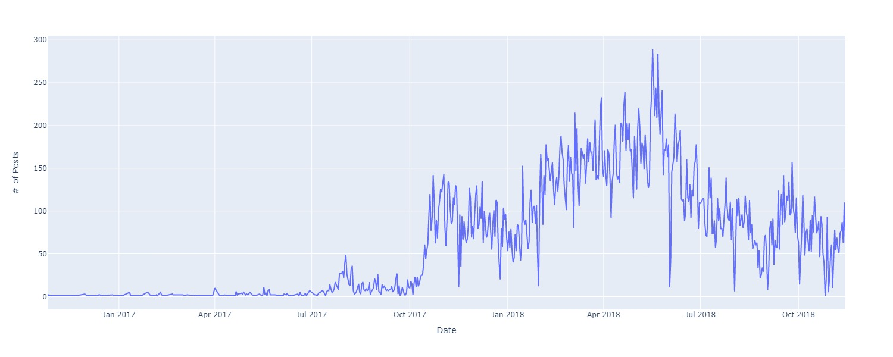
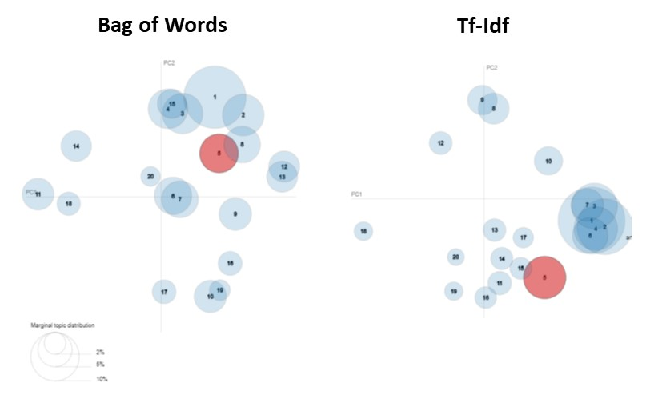
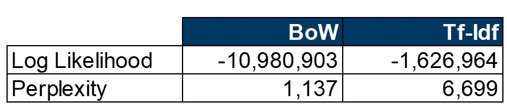
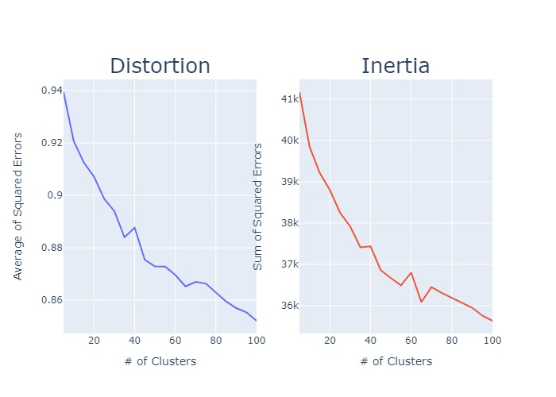

htmlwidgets: TRUE

<h1> What's Trending in the Darknet?</h1>
<h3> Wall Street Market Topic Modeling and Sentiment Analysis </h3>

<h2> What the Authorities Don't Tell You </h2>

    Darknet markets are abstract to the general market. Some of us may have watched Mr. Robot. Others may have read about the arrest/jail sentencing of Ross Ulbricht AKA "Dreat Pirate Roberts" the creator/operator of Silk Road, which is estimated to have averaged $15 million in annual sales.

    If one were to visit a darknet market, he/she will find a thriving economic ecosystem that resembles Ebay while arguably solving more complex technical challenges like ensuring anonymity and creating trust among thieves.

    Up until 2019, one of the most prosperous darknet markets was the Wall Street Market (WSM). The market placed included approximately 5,400 vendors, tens of thousands of items/services for sale, and more than 1.1 million user accounts. At its apex, WSM was the second largest globak darknet market. In May 2019, in a covert collaboration among investigators from the United States, Germany, and Netherlands arrested four individuals in Germany for creating/operating the WSM. Upon arrest, the authorities seized more than 550k in euros.

<h2> Project Motivation and Overview </h2>

    To improve the effecicacy of cybercrimbe investigations, authorities shoud understand the minds/habits of the marketplace participants. What topics are interested? How do they conduct business? How do they communicated?

    Similar to "standard" ecomerce, darknet market users communicate via  well-organized forums. A collection of these forum posts can serve as a remarkable corpus to training natural language processing (NLP) models. We can apply topic modeling to understrand the structure of a transaction and descriptions of products if an intelligence agency would like to imitate a darkweb market participant.

    After authorities shut down WSM, the forum posts were shared with a number of univeristy research institutions. The corpus is comprised of more than 42,000 posts written by over 5,500 unique members. The posts were published between October 2016 and November 2018.

<h2> Exploring Parts Unkown </h2>

    The line chart below shows the daily number of posts during the life of the dataset. We see a significant uptick in October 2017. Given lack of transparency of the darknet, we can only speculate as to what caused this increase in participation. 

    In July 2018, AlphaBay, which was one of the largest market at the time, was shut down by U.S., Canadian and Thailand law enforcement. It's possible that AlphaBay users/vendors migrated to Wall Street. The lag can partially be explained by the application process required for vendors. Markets may demand that vendors prove reputation or provide cash deposits via cryptocurrencies.

<h3> Wall Street Market Forum Daily Post Frequency </h3>

    As previously mentioned, WSM is a vibrant marketplace comprised of prosperous entrepreneurs. Consequently, the most frequently used words are nearly identical to the words - e.g. vendor, market, bank, and account - that one would expect to be popular in a legal marketplace. 

<h3> Wall Street Market Forum Word Frequency</h3>

<h2> Data Processing </h2>

    The forum posts were in html which required parsing and removal of HTML vestige, e.g. "\n". Additionally, the majority of the writing was informal and serial numbers and websites were referenced throughout the documents. The serial numbers and websites were removed.

    We removed the punctuations and expanded contracted works, e.g. "who's" became "who is". In addition to the default stopwords, a number of "noninformative" words were added to the list and ommitted, eg. "thing" and "could". 

    The documents were then lemmatized, which differs from stemming. Both lemmatization and stemming generate the root form of the document's words. The difference is that lemma is an actual language word whereas a stem may not be a coherent word. After lemmatization, the documents were tokenized. 

    These were the format of the inputs to either the Bag-of-Words(BoW) or Term Frequency-Inverse Document Frequency(Tf-Idf) vectorizer that were used to transform text into numbers/vectors.

<h2> Topic Modeling </h2>

    Two approaches were selected for topic modeling: Latent Dirichlet Allocation(LDA), which applies statistics and K-Means Clustering (K-Means), which uses linear algebra. 

<h3> Latent Dirichlet Allocation </h3>

    As previously mentioned, LDA is a statistical approach to topic modeling. Latent means hidden; therefore, LDA constructs a "hidden" layer, that are imaginary topics. The documents are then defined as a distribution of the imaginary topics. The next phase in the model is to define each imaginary topic by a distribution of words included in the corpus.

    I selected 20 components, an arbitrary value that was primarily elected for ease of visualization. In future revisions, I will identify the optimal value. I also applied two LDA methods. The methods differed in how I transformed/vectorized the documents into numerical values. I used BoW and Tf-Idf vectorization. The charts below demonstrate that BoW was more sucessful in differing the topics within the

    To assess the two methods, I used perplexity. Perplexity has limitations - optimizing for perplexity may not yield human interpretable topics. Coherence score is most likely better suited for this task. In this project's second iteration, I will use Gensim instead of Sklearn to implement the LDA model. 
<h3> 

<h3> K-Means Clustering </h3>
